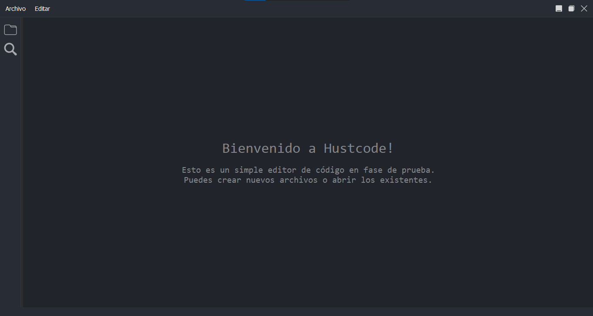
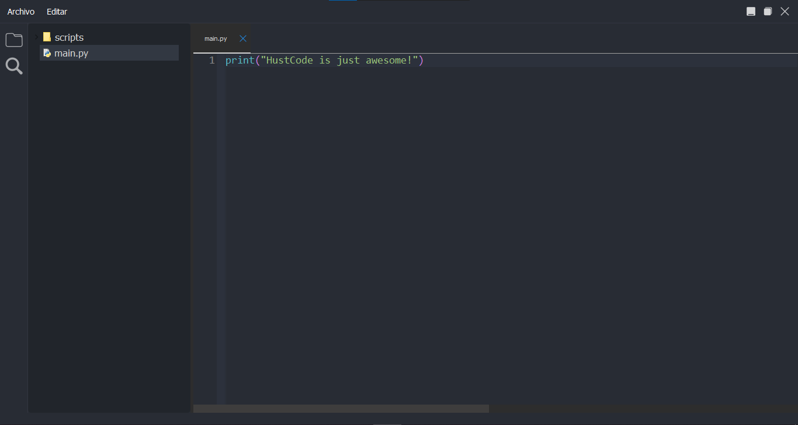

## HustCode 

                            (screenshots/HustCode1.png)

HustCode es un editor de código simple y elegante diseñado para mejorar tu experiencia de programación. Con una interfaz intuitiva y características útiles, HustCode está diseñado para ayudarte a escribir código de manera más eficiente y productiva.

### Características principales

- **Interfaz limpia y moderna:** HustCode ofrece una interfaz de usuario minimalista que te permite concentrarte en tu código sin distracciones innecesarias.
  
- **Edición de código avanzada (Próximamente):** Próximamente, HustCode ofrecerá características avanzadas de edición de código, como resaltado de sintaxis y autocompletado inteligente, para ayudarte a escribir código más rápido y con menos errores.

- **Gestión de archivos integrada:** Explora fácilmente tus proyectos y archivos con el administrador de archivos integrado. Abre, guarda y organiza tus archivos con facilidad.

- **Soporte para múltiples lenguajes de programación (En desarrollo):** Actualmente, estamos trabajando en agregar soporte para una amplia variedad de lenguajes de programación, lo que te permitirá trabajar en diferentes proyectos sin problemas.

- **Personalizable y extensible (Próximamente):** En el futuro, podrás personalizar el aspecto y el comportamiento de HustCode según tus preferencias. Además, podrás ampliar su funcionalidad con complementos y extensiones.

### Capturas de pantalla

### Instalación

### .... Que buscas?

### Contribuir

Si deseas contribuir al desarrollo de HustCode, ¡nos encantaría recibir tu ayuda! Puedes contribuir de las siguientes formas:

- Reportando problemas y errores
- Sugerencias de nuevas características
- Enviando parches y solicitudes de extracción

#### ¡Gracias por usar HustCode y esperamos que te sea útil en tus proyectos de programación!
